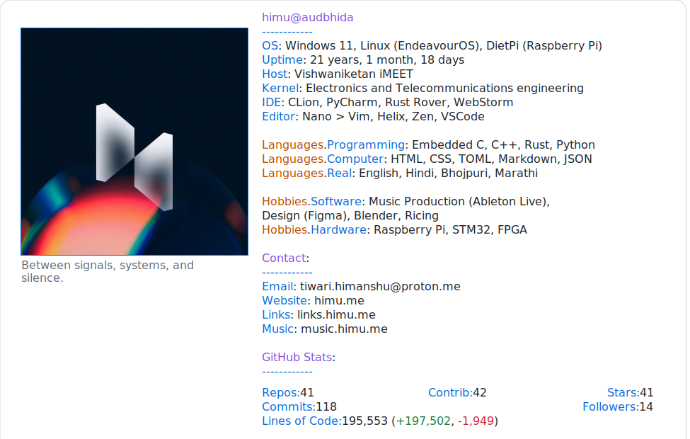

# Dynamic GitHub Profile Card

This repository updates two SVG profile “cards” (dark & light) with:
- Uptime (age since birthdate)
- Public repos owned
- Total stars on owned repos
- Commits (heavy scan, optional)
- Contributed repos (owned + collaborator + org member)
- Followers
- Lines of code added / deleted / net (heavy scan, optional)

The README embeds the SVGs with automatic dark/light switching.

## Preview

<picture>
  <source media="(prefers-color-scheme: dark)" srcset="dark.svg">
  
</picture>

## How it Works

1. `update_profile.py` calls the GitHub GraphQL API.
2. Heavy metrics (LOC & per‑commit counting) use a cache file in `cache/` to avoid re-scanning unchanged repositories.
3. The script rewrites text inside the SVGs by locating `<tspan id="...">` elements (or rebuilding the stats container block).
4. A GitHub Actions workflow (`.github/workflows/profile-card.yml`) runs daily and on pushes to `main`.

## Environment Variables

| Variable       | Purpose | Default |
| -------------- | ------- | ------- |
| `ACCESS_TOKEN` | Fine-grained or classic PAT (optional; falls back to `GITHUB_TOKEN`) | (none) |
| `USER_NAME`    | GitHub username to analyze | repo owner / actor |
| `BIRTHDATE`    | ISO date `YYYY-MM-DD` | `2005-01-17` |
| `DO_HEAVY`     | `1` to perform commit & LOC deep scan, `0` to skip | `1` in workflow schedule, else `0` |
| `FORCE_CACHE`  | `1` to rebuild LOC cache file | `0` |
| `EMBED_FONT`   | `1` to inline Google Fonts (JetBrains Mono) | `1` |

If you set `DO_HEAVY=0`, commits will be skipped (0) and LOC collection is skipped (faster & fewer API calls).

## Local Testing

Quick run (macOS/Linux):

```bash
python -m venv .venv
source .venv/bin/activate
pip install -r cache/requirements.txt

export ACCESS_TOKEN=ghp_yourTokenHere   # or rely on GITHUB_TOKEN inside Actions
export USER_NAME=HimuCodes
export BIRTHDATE=2005-01-17
export DO_HEAVY=0                       # quick test without LOC/commit deep scan
python update_profile.py
```

Open `dark.svg` or `light.svg` in a browser or VS Code to verify updates.

Heavy run:

```bash
export DO_HEAVY=1
python update_profile.py
```

Offline test (no network) with canned responses:

```bash
pytest -q
```

(`tests/offline_test.py` mocks `requests.post`).

## Caching

The cache file: `cache/<sha256(username)>.txt`
Format: `sha256(repo) totalCommits myCommits additions deletions`
Updated only if a repository’s default branch total commit count changes.

## Adjusting the Layout

All dynamic values are associated with IDs:
```
age_data, repo_data, star_data, commit_data, contrib_data, follower_data,
loc_data, loc_add, loc_del
```
Edit styling (colors, fonts) directly in the SVG `<style>` block.

The vertical spacing between Hobbies.Hardware and Contact was tightened so it matches other section spacings.

## Troubleshooting

- “403” or rate limiting: reduce heavy scans (set `DO_HEAVY=0`) or run less frequently.
- Missing numbers: ensure the corresponding `<tspan id="...">` exists or that `stats_container` is present.
- Large repository histories: the LOC/commit scan can take minutes; skip or schedule weekly if needed.

## License / Attribution

Core logic adapted & simplified from the public concept demonstrated by Andrew6rant’s profile repository. Adjusted for personal use by HimuCodes.

